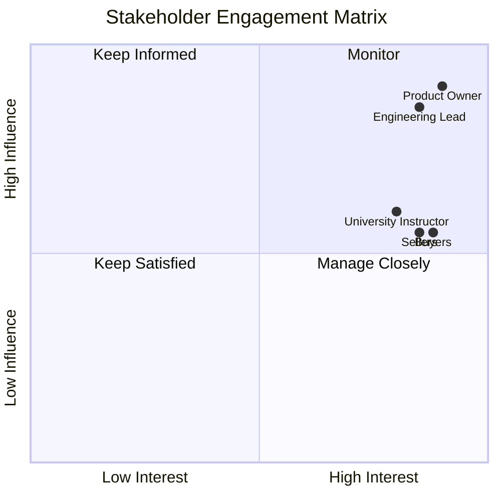

# Second-Hand Marketplace - Stakeholder Analysis

## Stakeholder Categories

### Primary Stakeholders
| Stakeholder | Role | Key Expectation |
|---|---|---|
| Buyers | Browse and contact sellers | Fast search, accurate listings, easy messaging |
| Sellers | Post and manage listings | Simple listing creation, dashboard control, buyer contact |
| Product Owner | Value prioritization | Adoption, listing activity, user retention |

### Secondary Stakeholders
| Stakeholder | Role | Key Expectation |
|---|---|---|
| University Reviewers / Faculty | Academic assessment | Complete SDLC documentation, traceability |
| Customer Support | Issue resolution | Clear UX and predictable system behavior |

### Internal Stakeholders
Engineering, QA, DevOps, Product Management, UX.

### External Stakeholders
Cloud provider (Railway/Render/Vercel), image hosting provider (Cloudinary), university academic reviewers.

## Stakeholder Influence-Interest Matrix
| Stakeholder | Influence | Interest |
|---|---|---|
| Product Owner | High | High |
| Engineering Lead | High | High |
| QA Lead | Medium | High |
| DevOps Lead | Medium | Medium |
| Buyers (End Users) | Medium | High |
| Sellers (End Users) | Medium | High |
| University Instructor | Medium | High |
| External Auditor | Low | Medium |

## Engagement Strategy

## RACI Matrix
| Deliverable | Product Owner | BA | Architect | Engineering | QA | DevOps | Instructor/Reviewer |
|---|---|---|---|---|---|---|---|
| PRD | A | R | C | C | C | I | C |
| SRS | A | R | C | C | C | I | C |
| Architecture Design | C | C | A/R | R | C | C | I |
| API Design | C | C | A | R | C | I | I |
| Implementation | I | I | C | A/R | C | C | I |
| Test Plan & Cases | I | C | C | C | A/R | I | I |
| Release Readiness | A | I | C | R | R | R | I |
| Signoff | A | C | C | C | C | C | R |

**Legend:** R = Responsible, A = Accountable, C = Consulted, I = Informed.
