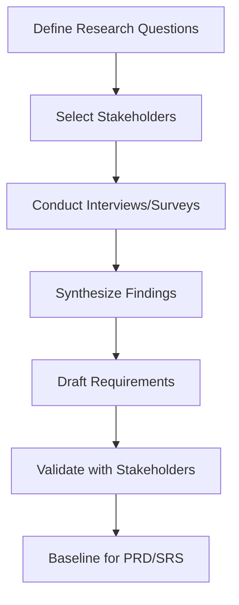

# Second-Hand Marketplace - Information Gathering Report

## Why Information Gathering Is Necessary
Understanding how users currently buy and sell second-hand goods is essential before designing the platform. Without this phase, features could be built that are technically correct but operationally irrelevant to real user behavior.

## Requirement Elicitation Goals
| Goal ID | Goal |
|---|---|
| EG-01 | Identify the core friction points in current second-hand trading workflows |
| EG-02 | Convert user pain into measurable, testable requirements (FR/NFR) |
| EG-03 | Validate technical and schedule feasibility early |
| EG-04 | Build traceable artifacts for engineering and academic review |

## Methodology Used
| Method | Target Group | Purpose | Output |
|---|---|---|---|
| Interviews | Students, sellers, frequent buyers | Deep qualitative insights | Pain maps, candidate stories |
| Surveys | ~50 participants | Quantitative feature prioritization | Feature demand ranking |
| Observation | Facebook group / WhatsApp trading behavior | Real workflow validation | Process bottleneck analysis |
| Document Analysis | Existing classifieds platforms | Gap and best-practice comparison | Baseline capability matrix |

## Elicitation Process

## Key Findings
| Finding ID | Finding | Requirement Implication |
|---|---|---|
| IF-01 | Buyers cannot find items because listings are buried in chats | FR-022..FR-026 (search/filter/sort) |
| IF-02 | Sellers have no way to know if a listing is still visible to others | FR-034..FR-036 (seller dashboard) |
| IF-03 | Messaging via public comments exposes phone numbers and privacy | FR-029..FR-033 (in-platform messaging) |
| IF-04 | Buyers want to save interesting listings for later comparison | FR-037..FR-038 (favorites) |
| IF-05 | Sellers lose track of which items are sold vs still available | FR-012 (mark as sold), FR-034 (dashboard stats) |

## Requirement Themes
1. **Discovery first:** search, filter, and sort are the most critical buyer-facing features.
2. **Listing structure:** photos, price, category, and condition are the minimum viable listing data.
3. **Private communication:** in-platform messaging replaces unsafe public contact.
4. **Seller control:** sellers need a dashboard to manage listing state and review activity.

## Outcome
The elicitation output became the baseline for PRD, user stories, FR/NFR, use cases, SRS, design, and QA traceability.
