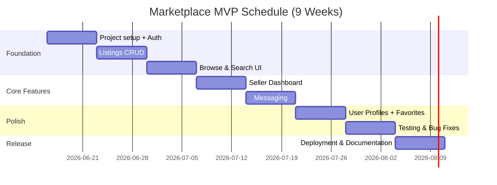

# Second-Hand Marketplace - Feasibility Analysis

## Feasibility Summary
| Dimension | Status | Conclusion |
|---|---|---|
| Technical | Feasible | Stack is well-suited for listing and messaging features |
| Economic | Feasible | Low-cost deployment on free-tier cloud platforms |
| Operational | Feasible | Solo or small team can operate within semester timeline |
| Legal | Feasible with controls | No payment processing; standard privacy considerations |
| Schedule | Feasible (8 weeks build) | MVP in ~9 weeks with phased scope |
| Risk | Manageable | Mitigation plan documented in Risk Register |

## Technical Feasibility
- **Frontend:** React provides modular UI, reusable components, and responsive design.
- **Backend:** Python FastAPI provides high-performance async APIs, strong validation, and rapid development.
- **Database:** PostgreSQL is mature, relational, and well-suited for listings, users, messages, and favorites.
- **Auth:** JWT fits stateless API-first architecture.
- **Image Hosting:** Cloudinary (or local storage) handles image upload with minimal backend complexity.
- **Deployment:** Docker images deployable to Railway or Render free tier; frontend on Vercel or Netlify.

## Economic Feasibility
### Cost Estimate (Semester Project)
| Cost Component | Estimated Cost |
|---|---|
| Engineering time (student) | Sweat equity |
| Railway / Render hosting | Free tier |
| Cloudinary image hosting | Free tier |
| Domain (optional) | ~$10 USD |
| **Total** | **~$10 USD** |

### Benefit Estimate
| Benefit | Value |
|---|---|
| Academic grade and portfolio project | High |
| Demonstrated SDLC documentation capability | High |
| Reusable codebase for future enhancements | High |

## Operational Feasibility
| Area | Readiness | Notes |
|---|---|---|
| Development workflow | High | Standard Git + local dev setup |
| Deployment pipeline | Medium | Manual deploy or basic CI/CD to free tier |
| Monitoring | Low (MVP) | Console logs sufficient for academic project |

## Legal Feasibility
1. No payment data is processed — reduces compliance scope significantly.
2. User data (email, listings) should be handled with basic privacy awareness.
3. Image uploads should be screened for inappropriate content (basic validation only for MVP).

## Schedule Feasibility

## Risk Feasibility
| Risk Category | Feasibility Concern | Mitigation |
|---|---|---|
| Technical | Image upload complexity | Use Cloudinary SDK; local fallback |
| Schedule | Scope creep (messaging + search) | Fixed feature list; AI deferred to post-submission |
| Operational | Free-tier service limits | Use Railway/Render generous free tiers; optimize queries |

## Conclusion
The Second-Hand Marketplace is fully feasible within a semester timeline when scoped to the MVP feature set (auth, listings, browse/search, messaging, seller dashboard, favorites). AI features are intentionally deferred to post-submission enhancement.
