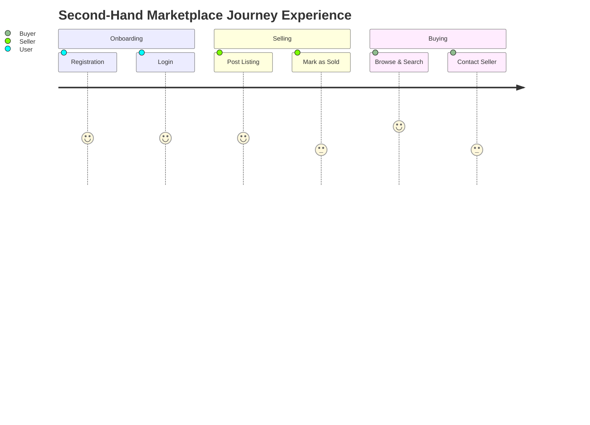

# Second-Hand Marketplace - User Journey Map

## Journey Stages
Registration -> Login -> Post Listing -> Browse & Search -> Contact Seller -> Complete Transaction

## End-to-End Journey Table
| Stage | User Goal | User Actions | System Response | Pain Risk | Improvement Opportunities | Linked IDs |
|---|---|---|---|---|---|---|
| Registration | Create account quickly | Submit name, email, password | Validate input, create user, issue token | Form errors or unclear feedback | Inline validation and clear error messages | UC-01, FR-001..FR-003 |
| Login | Access marketplace securely | Enter credentials | Authenticate and issue JWT | Failed auth loops | Clear feedback and lockout policy | UC-02, FR-004..FR-007 |
| Post Listing | Sell an item | Upload images, fill title/description/price/category/condition | Persist listing and show in browse feed | Long upload or poor image quality | Drag-drop upload, compression, and preview | UC-03, FR-009..FR-013 |
| Browse & Search | Find a relevant item to buy | Search by keyword, filter by category/condition/price | Return filtered listing cards with images | Irrelevant results or no results | Smart filters and empty-state guidance | UC-05, UC-06, FR-020..FR-024 |
| Contact Seller | Enquire about an item | Send message to seller via listing page | Deliver message to seller inbox | Message not seen, slow replies | Notification on new message for seller | UC-07, FR-028..FR-030 |
| Complete Transaction | Agree on a deal and close listing | Seller marks listing as sold | Listing status updates, removed from active feed | Forgetting to mark sold, stale listings | Mark-sold prompt and automatic archiving | UC-08, FR-015, FR-016 |

## Experience Heatmap

## Key Journey Improvements
1. Reduce listing creation friction with multi-image upload and guided form fields.
2. Improve buyer discovery with category filters, condition filters, and price range inputs.
3. Tighten communication loop with message notifications so sellers respond faster.
