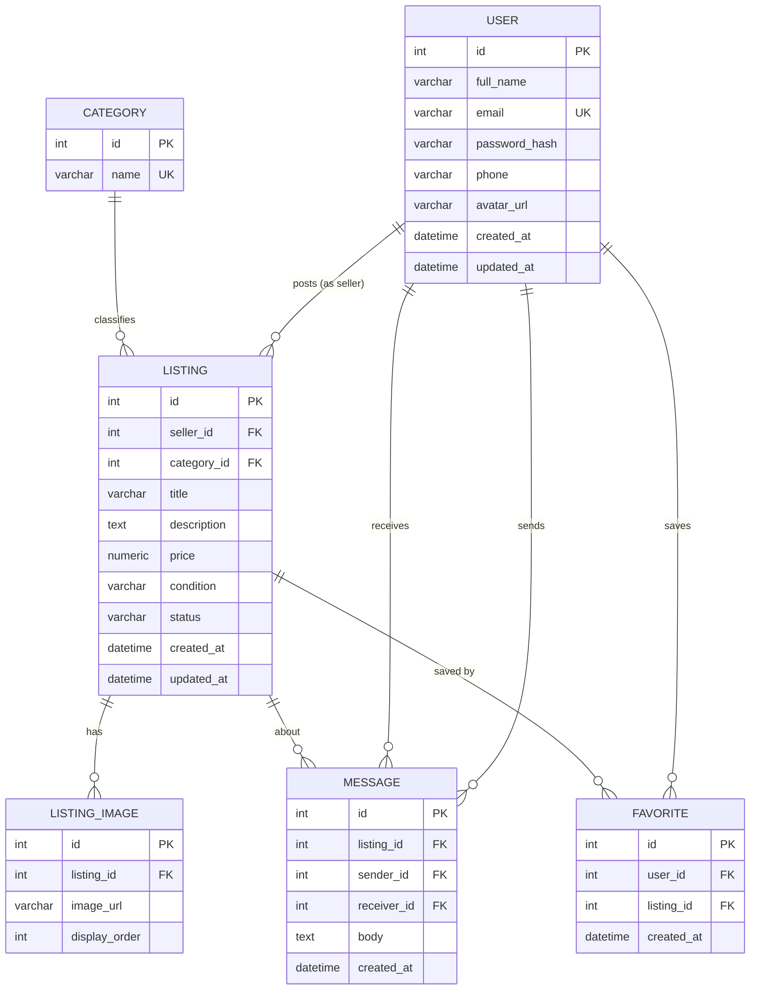

# Second-Hand Marketplace — Entity Relationship Diagram (ERD)

> **Note:** This ERD is the logical domain model for the marketplace.
> Physical persistence is a **PostgreSQL relational database** managed via SQLAlchemy ORM, documented in [21-database-design.md](21-database-design.md).

---

## Entity Overview

| Entity | Purpose |
|---|---|
| User | Stores account information; acts as both buyer and seller |
| Listing | A second-hand item posted for sale by a seller |
| ListingImage | One or more images attached to a listing |
| Category | Predefined categories for classifying listings |
| Message | A direct message sent between buyer and seller about a listing |
| Favorite | A saved listing for a user's favorites list |

---

## Entity Attributes

### User
`id, full_name, email, password_hash, phone, avatar_url, created_at, updated_at`

### Category
`id, name`

### Listing
`id, seller_id (FK→User), category_id (FK→Category), title, description, price, condition, status, created_at, updated_at`

- `condition`: enum — `new`, `like_new`, `good`, `fair`
- `status`: enum — `active`, `sold`

### ListingImage
`id, listing_id (FK→Listing), image_url, display_order`

### Message
`id, listing_id (FK→Listing), sender_id (FK→User), receiver_id (FK→User), body, created_at`

### Favorite
`id, user_id (FK→User), listing_id (FK→Listing), created_at`

- Unique constraint on `(user_id, listing_id)` — a user can only save a listing once.

---

## Relationship Rules

1. One **User** can own many **Listings** (as seller).
2. One **Listing** belongs to one **Category**.
3. One **Listing** can have many **ListingImages** (up to 5).
4. One **Listing** can have many **Messages** (conversations about it).
5. One **Message** has one sender and one receiver, both are **Users**.
6. One **User** can have many **Favorites**; one **Listing** can be favorited by many **Users**.

---

## Mermaid ER Diagram

