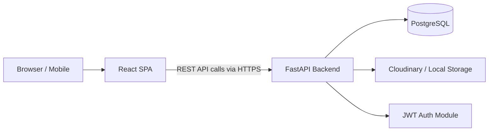
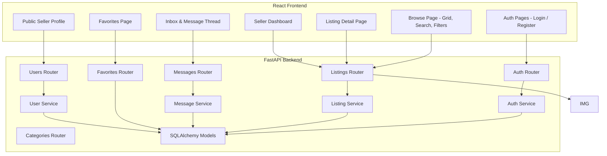
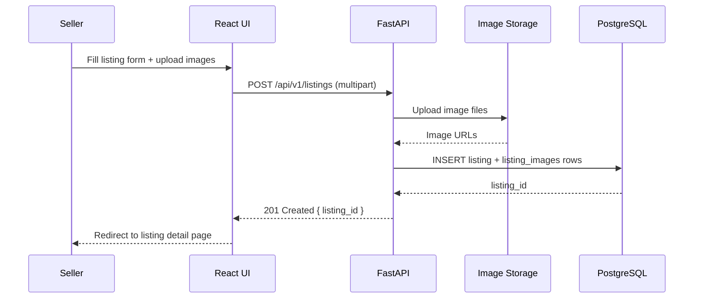
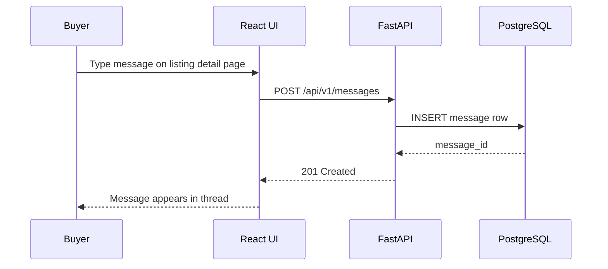
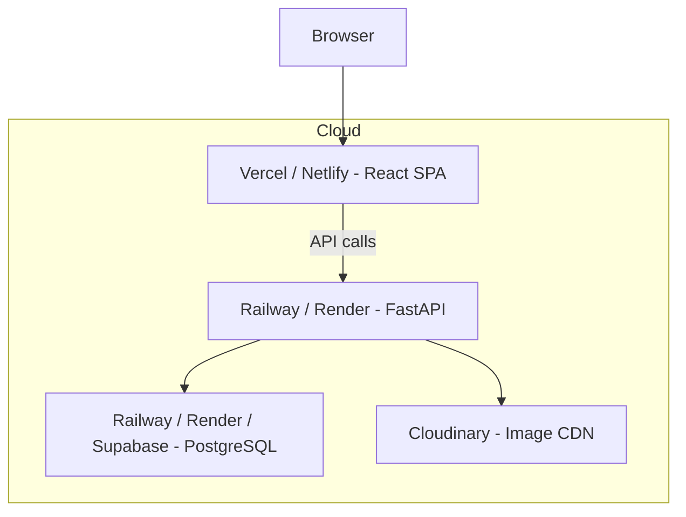

# Second-Hand Marketplace — System Design

## High-Level Design

The marketplace follows a standard three-tier, API-first web architecture:

1. **Presentation Layer:** React SPA (served via Vercel / Netlify).
2. **Application Layer:** Python FastAPI backend providing RESTful endpoints.
3. **Data Layer:** PostgreSQL relational database accessed via SQLAlchemy ORM.
4. **Storage Layer:** Cloudinary (or local filesystem) for listing images.

---

## Architecture Diagram

---

## Component Diagram

---

## Data Flow — Posting a Listing

---

## Data Flow — Buyer Sends a Message

---

## Security Architecture

| Layer | Control |
|---|---|
| Identity | JWT access token + optional refresh token |
| API | Route-level authorization (owner-only checks for edit/delete) |
| Data | Passwords hashed with bcrypt |
| Transport | HTTPS / TLS in production |
| Input | Pydantic request validation on all endpoints |

---

## Deployment Architecture

All services use free-tier hosting suitable for academic project submission and demo.

---

## Scalability Notes (Future / Post-submission)

| Concern | Approach |
|---|---|
| Image optimization | Cloudinary transformation URLs for resizing on-the-fly |
| Search performance | Add PostgreSQL full-text search index on title + description |
| Real-time messaging | Upgrade to WebSocket or Server-Sent Events in a future version |
| Caching | Add Redis cache for browse page results in a future version |
